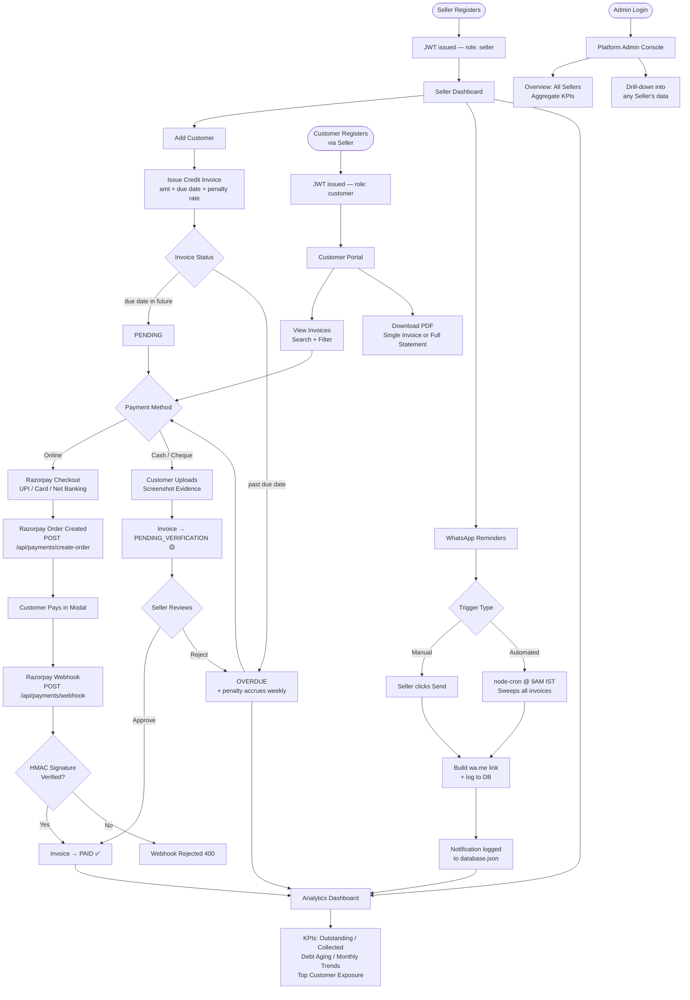

# Hisaab360 💳

> **Smart Wholesale Credit & Collections Management**

A full-stack, production-deployed web platform that helps small wholesale businesses
issue credit invoices, track overdue payments with automatic penalty accrual, collect
payments via Razorpay (UPI, cards, net banking) or verified cash/cheque workflows, and
send WhatsApp payment reminders — all from a clean, mobile-responsive dashboard.

---

## Why I Built This

My family runs a small wholesale distribution business. Every month-end meant the same
thing: a notebook full of names, amounts, and crossed-out entries, and hours of manually
calling customers to chase payments. There was no system — just memory and spreadsheets.

I started building Hisaab360 to solve that one specific problem. It grew into a
full production-deployed, two-sided platform: **sellers** manage their customer ledgers
and collect payments through a real payment gateway; **customers** have their own portal
where they can view statements, make payments, and download invoices. A platform
**Admin** role oversees all sellers across the system.

---

## Live Demo

| | URL |
|---|---|
| **Frontend** | `https://YOUR-APP.vercel.app` *(replace with your Vercel URL)* |
| **Backend API** | `https://YOUR-BACKEND.onrender.com` *(replace with your Render URL)* |
| **API Health Check** | `https://YOUR-BACKEND.onrender.com/api/health` |

### Demo Credentials

> [!IMPORTANT]
> The demo seed account is created automatically on **first server boot** if no
> `database.json` exists. On Render's free tier (no persistent disk), the database
> resets on each redeploy — meaning demo data is re-seeded fresh each time, but any
> data **you** created during a session is lost on the next deploy. The admin account
> is always re-seeded safely on every boot.

| Role | Email | Password | Notes |
|------|-------|----------|-------|
| **Seller** | `seller@hisaab360.com` | `demo123` | Pre-seeded with 3 customers & 3 invoices |
| **Admin** | `admin@hisaab360.com` | `admin123` | Always available; sees all sellers |
| **Customer** | *(register via Seller dashboard)* | *(set on registration)* | Customers are added by their seller; then log in with email/phone at `/auth?role=customer` |

> [!NOTE]
> Razorpay is in **test mode**. Use test card `4111 1111 1111 1111` / CVV `123` /
> any future expiry for payments. No real money is charged.

---

## Features

### 👔 Seller Dashboard

- **Seller Registration & Login** — bcrypt-hashed passwords, JWT sessions
- **Customer Management** — add, edit customers; each scoped to the seller's account only
- **Credit Invoice Lifecycle** — issue invoices with configurable penalty rates (% per week); statuses: `pending → overdue → pending_verification → paid`
- **Automatic Penalty Accrual** — penalties calculated on every server boot and API call; overdue invoices show real-time accrued amounts
- **Edit & Delete Invoices** — invoices can be edited (with penalty recalculation) or deleted via confirmation dialog
- **Analytics Dashboard** — KPI cards (Total Outstanding, Total Collected, Collection Rate, Overdue Amount), debt aging buckets (0–15 / 16–30 / 31–45 / 46+ days), monthly billed-vs-collected chart (last 6 months), top-5 customer exposure list
- **WhatsApp Reminder System** — three templates: *Before Due* (7/3/1 days), *Due Today*, *Overdue*; generates a `wa.me/` deep link that opens in WhatsApp with a pre-filled message; logs every send to the notification history
- **Automated Daily Reminders** — `node-cron` scheduler runs at 9 AM IST, sweeps all invoices, sends appropriate template, deduplicates (won't re-send the same template twice in one day), skips `pending_verification` and `paid` invoices
- **Bulk Invoice Actions** — select multiple invoices with checkboxes; "Send Reminder to Selected" and "Mark Selected as Paid" bulk operations
- **Cash/Cheque Verification Workflow** — when a customer submits a cash/cheque payment (with screenshot evidence), the invoice enters `pending_verification`; seller can **Approve** (marks paid) or **Reject** (removes the payment entry)
- **Multi-Currency Support** — 10 currencies (INR, USD, EUR, GBP, AED, SAR, PKR, BDT, CAD, AUD); stored per seller, used on all invoices, PDFs, and reminders
- **PDF Invoice Generation** — branded A4 PDF with seller/customer details, invoice table, payment history, penalty breakdown, and outstanding balance
- **Customer Detail Panel** — per-customer stats: total billed, total paid (verified only), outstanding balance, pending verification amount, payment behaviour score (Excellent/Good/Slow/Risky based on average days-to-pay)
- **Browser Push Notifications** — HTML5 Notification API; notifies sellers when a payment is recorded
- **Dark / Light Theme Toggle** — CSS variable-based theme system; toggle in the top nav; preference persists across sessions
- **Mobile-Responsive UI** — mobile bottom nav component; tested on small screens

### 🧾 Customer Portal

- **Customer Login** — JWT session scoped to their seller
- **Invoice Table** — all their invoices with status badges; **search by Invoice ID** and **filter by status** (All / Paid / Overdue / Pending / Pending Verification)
- **Razorpay Online Payment** — opens Razorpay checkout modal; supports UPI, Credit Card, Debit Card, Net Banking; amount pre-filled from outstanding balance; webhook-verified on backend before marking paid
- **Cash / Cheque Payment Submission** — upload screenshot/receipt evidence; payment enters `pending_verification` until seller approves; "Under Review" button shown while pending
- **UPI QR Code** — if seller has configured a UPI ID, a scannable QR is shown; if not, a clear "not configured" message replaces it (no fake QR)
- **PDF Statement Download** — "Download Full Statement" generates a consolidated A4 PDF with all invoices, running totals (Total Billed / Total Paid / Net Outstanding), and a summary KPI card row
- **Single Invoice PDF** — download individual invoice PDF with full payment history and audit trail
- **Notification History** — log of all reminders received (type, message, timestamp)
- **Browser Push Notifications** — notified when a new invoice is issued

### 🔐 Platform Admin

- **Admin Login** — separate JWT role; no seller scoping
- **Platform Overview** — aggregate KPIs across all sellers: total sellers, customers, invoices, platform-wide billed/collected/outstanding
- **Seller List** — all registered sellers with individual metrics
- **Seller Detail Drill-down** — view any seller's full data (customers + invoices) in read-only mode

---

## Tech Stack

Verified directly from `package.json` files — nothing assumed.

### Backend (`backend/package.json`)

| Package | Version | Purpose |
|---------|---------|---------|
| `express` | ^4.19.2 | HTTP server and routing |
| `cors` | ^2.8.5 | Cross-origin request handling |
| `jsonwebtoken` | ^9.0.2 | JWT auth token signing & verification |
| `bcryptjs` | ^2.4.3 | Password hashing |
| `razorpay` | ^2.9.4 | Official Razorpay SDK for order creation & webhook verification |
| `node-cron` | ^3.0.3 | Daily reminder scheduler |
| **Node.js** | ≥18 | Runtime (`--env-file` flag requires Node 20+) |

**Data Storage:** Flat JSON file (`backend/database.json`) — read and written atomically via a temp-file rename pattern. No SQL or NoSQL database. This is intentional for portfolio/demo scale; see Known Limitations.

### Frontend (`frontend/package.json`)

| Package | Version | Purpose |
|---------|---------|---------|
| `react` | ^18.2.0 | UI framework |
| `react-dom` | ^18.2.0 | DOM rendering |
| `react-router-dom` | ^6.22.3 | Client-side routing, route guards |
| `vite` | ^5.1.6 | Build tool and dev server |
| `jspdf` | ^2.5.1 | PDF generation (invoice + statement) |
| `jspdf-autotable` | ^3.8.2 | Table layout plugin for jsPDF |
| `chart.js` | ^4.4.2 | Analytics charts |
| `react-chartjs-2` | ^5.2.0 | React wrapper for Chart.js |
| `lucide-react` | ^0.359.0 | Icon library |

---

## Architecture Flowchart



---

## Project Structure

```
hisaab360_new/
├── .gitignore
├── backend/
│   ├── .env                    # Real secrets — NOT committed
│   ├── .env.example            # Template — committed
│   ├── server.js               # Express app, CORS, middleware, seeding
│   ├── db.js                   # readData() / writeData() / ID generators
│   ├── scheduler.js            # node-cron daily reminder engine
│   ├── database.json           # Flat-file database (gitignored)
│   ├── middleware/
│   │   └── auth.js             # authenticateToken, isSeller, isAdmin guards
│   └── routes/
│       ├── auth.js             # /api/auth — register, login (seller/customer/admin)
│       ├── customers.js        # /api/customers — CRUD + /:id/stats
│       ├── invoices.js         # /api/invoices — CRUD + payment + verify-payment
│       ├── notifications.js    # /api/notifications — send-whatsapp + history
│       ├── analytics.js        # /api/analytics/dashboard
│       ├── payments.js         # /api/payments — Razorpay create-order, verify, webhook
│       └── admin.js            # /api/admin — overview, sellers list, seller detail
├── frontend/
│   ├── .env.local              # Local dev env — NOT committed
│   ├── .env.example            # Template — committed
│   ├── index.html
│   ├── vite.config.js
│   └── src/
│       ├── App.jsx             # Router, role-guarded routes
│       ├── index.css           # CSS variables, dark/light themes, component styles
│       ├── main.jsx
│       ├── assets/
│       ├── components/
│       │   ├── MobileBottomNav.jsx   # Bottom tab bar for mobile viewports
│       │   └── ThemeToggle.jsx       # Dark/light mode toggle button
│       ├── context/
│       │   ├── AuthContext.jsx       # JWT state, API_BASE_URL, auth helpers
│       │   └── ThemeContext.jsx      # Theme state and CSS class toggling
│       ├── pages/
│       │   ├── LandingPage.jsx       # Public marketing/login landing
│       │   ├── AuthPage.jsx          # Login/register for all three roles
│       │   ├── SellerDashboard.jsx   # Main seller console (~1700 lines)
│       │   ├── CustomerDashboard.jsx # Customer portal
│       │   └── AdminDashboard.jsx    # Platform admin console
│       └── utils/
│           ├── pdfGenerator.js       # jsPDF invoice + statement generators
│           ├── currencyFormatter.js  # formatCurrency() + SUPPORTED_CURRENCIES
│           └── browserNotifications.js # HTML5 Notification API helpers
```

---

## Getting Started (Local Development)

### Prerequisites
- Node.js v20+ (required for `--env-file` flag in dev script)
- A free [Razorpay account](https://razorpay.com) in test mode for payment features

### 1. Clone the repo

```bash
git clone https://github.com/YOUR_USERNAME/hisaab360.git
cd hisaab360
```

### 2. Set up the backend

```bash
cd backend
cp .env.example .env
```

Edit `backend/.env` with your real values:

```env
# Required — get from https://dashboard.razorpay.com/app/keys
RAZORPAY_KEY_ID=rzp_test_xxxxxxxxxxxxxxxxxxxx
RAZORPAY_KEY_SECRET=xxxxxxxxxxxxxxxxxxxxxxxx

# Required — get from Razorpay Dashboard → Settings → Webhooks → your webhook → Secret
RAZORPAY_WEBHOOK_SECRET=xxxxxxxxxxxxxxxxxxxxxxxx

# Required — generate a strong random string:
# node -e "console.log(require('crypto').randomBytes(48).toString('hex'))"
JWT_SECRET=your-64-char-random-string-here

# Required in production — your Vercel frontend URL (no trailing slash)
# Leave as localhost for local dev
FRONTEND_URL=http://localhost:5173

# Optional — Render sets this automatically; defaults to 3000 locally
PORT=3000
```

Install dependencies and start the backend:

```bash
npm install
npm run dev     # runs: node --env-file=.env --watch server.js
```

### 3. Set up the frontend

```bash
cd ../frontend
cp .env.example .env.local
```

`frontend/.env.local` content (already set correctly by default):

```env
VITE_API_BASE_URL=http://localhost:3000/api
```

Install and start the frontend:

```bash
npm install
npm run dev     # Vite dev server on http://localhost:5173
```

### 4. Open the app

| URL | Role |
|-----|------|
| `http://localhost:5173` | Landing page |
| `http://localhost:5173/auth?role=seller` | Seller login/register |
| `http://localhost:5173/auth?role=customer` | Customer login |
| `http://localhost:5173/auth?role=admin` | Admin login |

On first run, if `backend/database.json` doesn't exist, it's auto-seeded with:
- **Seller:** `seller@hisaab360.com` / `demo123`
- **Admin:** `admin@hisaab360.com` / `admin123`
- 3 demo customers and 3 sample invoices linked to the demo seller

---

## Deployment

### Frontend → Vercel

| Setting | Value |
|---------|-------|
| Root Directory | `frontend` |
| Framework Preset | Vite |
| Build Command | `vite build` |
| Output Directory | `dist` |
| Environment Variable | `VITE_API_BASE_URL=https://YOUR-BACKEND.onrender.com/api` |

### Backend → Render

| Setting | Value |
|---------|-------|
| Root Directory | `backend` |
| Runtime | Node |
| Build Command | `npm install` |
| Start Command | `node server.js` |

**Required Render environment variables:**

```
RAZORPAY_KEY_ID=rzp_test_...
RAZORPAY_KEY_SECRET=...
RAZORPAY_WEBHOOK_SECRET=...
JWT_SECRET=...
FRONTEND_URL=https://YOUR-APP.vercel.app
NODE_ENV=production
```

> [!WARNING]
> **`FRONTEND_URL` — no trailing slash.** `https://myapp.vercel.app` works.
> `https://myapp.vercel.app/` (with slash) will cause CORS to silently fail on every
> request.

> [!WARNING]
> **Free Render instances spin down after 15 minutes of inactivity.** The first request
> after sleep takes ~30 seconds (cold start). Upgrade to Starter (\$7/mo) for always-on.

> [!IMPORTANT]
> **Razorpay Webhook URL** must point to your live Render backend, not ngrok:
> `https://YOUR-BACKEND.onrender.com/api/payments/webhook`
> Configure this in Razorpay Dashboard → Settings → Webhooks.

### Cross-wiring after both are deployed

1. Deploy backend to Render → copy the Render URL
2. Set `VITE_API_BASE_URL=https://YOUR-BACKEND.onrender.com/api` in Vercel env vars
3. Deploy frontend to Vercel → copy the Vercel URL
4. Set `FRONTEND_URL=https://YOUR-APP.vercel.app` in Render env vars → triggers redeploy
5. Update Razorpay webhook URL from ngrok to the live Render URL

---

## Known Limitations

These are honest trade-offs, not bugs. Most are appropriate for a portfolio-scale project.

| Limitation | Detail |
|------------|--------|
| **JSON file storage** | `database.json` is not a real database. No concurrent write safety under high traffic. Fine for demo/portfolio scale; would need migration to PostgreSQL or MongoDB for production multi-seller use. |
| **No persistent disk on Render free tier** | Render free instances have ephemeral storage — `database.json` is lost on redeploy. Upgrading to Render's Starter plan with a persistent disk attachment resolves this. |
| **WhatsApp "sending" is a deep link, not an API call** | The app generates a `wa.me/?text=...` URL that opens WhatsApp on the seller's device with a pre-filled message. The seller still manually taps Send. A real WhatsApp Business API integration would require a Meta-approved business account. |
| **Portal links in reminder messages are hardcoded to `localhost:5173`** | Both `notifications.js` and `scheduler.js` embed `http://localhost:5173/...` in the WhatsApp message body. In production, customers receive a link pointing at localhost (which doesn't work). Fix: set a `PORTAL_URL` env var and substitute it. |
| **Razorpay is INR-only** | Razorpay's checkout only processes INR. The multi-currency display (UI labels, PDFs) supports 10 currencies, but actual payment collection is always in INR regardless of the seller's currency setting. |
| **No real email notifications** | There is no email delivery. All notifications are WhatsApp deep links or browser push notifications via the HTML5 Notification API. |
| **Single-region deployment** | Deployed on Render US region + Vercel's CDN. No geo-redundancy. |

---

## Roadmap

- [ ] **Real database** — migrate `database.json` to PostgreSQL (via Prisma) or MongoDB Atlas for production-grade storage, concurrent writes, and proper backups
- [ ] **Fix portal link in reminders** — replace hardcoded `localhost:5173` with a `PORTAL_URL` environment variable so WhatsApp reminder links work in production
- [ ] **Real WhatsApp Business API** — integrate Meta's official Cloud API to actually send messages programmatically instead of opening a deep link
- [ ] **Native mobile app** — React Native client as an alternative to the current responsive web app + "Add to Home Screen" approach
- [ ] **Full PWA** — service worker, offline capability, installable app with background sync for reminder delivery
- [ ] **Admin panel enhancements** — cross-seller analytics, platform-wide trend reporting, ability to suspend/manage sellers
- [ ] **Custom domain** — replace default `*.vercel.app` / `*.onrender.com` URLs with a custom domain
- [ ] **Multi-language / i18n** — Hinglish and regional language support for reminder messages
- [ ] **Bulk CSV import** — let sellers upload a CSV of customers and invoices instead of adding them one by one

### Already shipped ✅
- Dark/light theme toggle (CSS variable system)
- Bulk invoice selection: "Send Reminder to Selected" + "Mark Selected as Paid"
- Customer-side invoice search and status filter
- Edit and delete invoices (with penalty recalculation)
- Cash/Cheque offline payment verification workflow

---

## Screenshots

> *(Add these after first deployment — take screenshots on the live Vercel URL, not localhost)*

| Screen | Placeholder |
|--------|------------|
| Landing / Login page | `[Add screenshot: frontend/landing-login.png]` |
| Seller Analytics Dashboard | `[Add screenshot: seller-analytics.png]` |
| Credit Invoices Tab + Bulk Select | `[Add screenshot: seller-invoices-bulk.png]` |
| Customer Portal — Invoice Table with Search | `[Add screenshot: customer-portal.png]` |
| Razorpay Payment Modal | `[Add screenshot: razorpay-checkout.png]` |
| Cash/Cheque Upload & Pending Verification | `[Add screenshot: cash-cheque-flow.png]` |
| Seller Approves / Rejects Payment | `[Add screenshot: verify-payment.png]` |
| PDF Invoice Download | `[Add screenshot: pdf-invoice.png]` |
| Admin Dashboard — Seller Overview | `[Add screenshot: admin-dashboard.png]` |

---

## Author

**Vanshi** — built as a personal project to solve a real family business problem, grown into a full-stack portfolio piece.

- GitHub: [@YOUR_USERNAME](https://github.com/YOUR_USERNAME)
- LinkedIn: [Add LinkedIn profile link here]

---

*Built with Express, React, Vite, Razorpay, jsPDF, node-cron, and a flat JSON file standing in for a database.*
